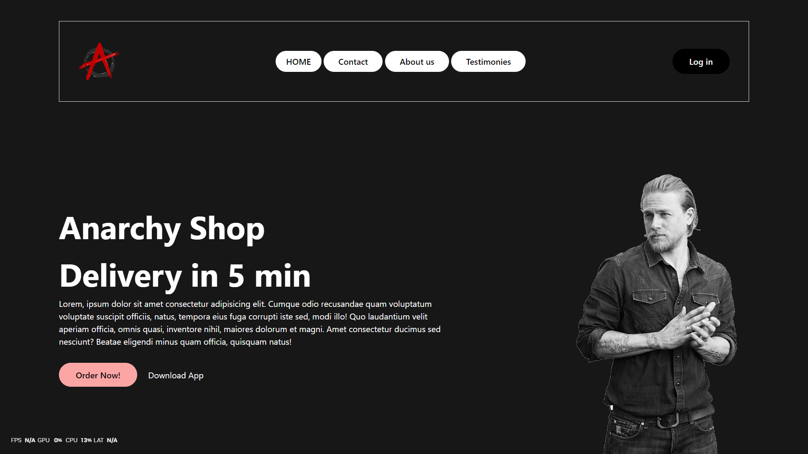

# Shock-Site
A site design made as an hobby.
# Anarchy Shop

## Overview

Welcome to Anarchy Shop! This is a frontend demo built with Tailwind CSS. The website is designed to provide a clean, modern user interface for an e-commerce platform that promises delivery in just 5 minutes. The demo showcases a responsive layout, stylish navigation, and an engaging call-to-action section.

## Features

- **Responsive Design:** Adapts seamlessly to different screen sizes.
- **Navigation Menu:** Easy-to-use and visually appealing.
- **Hero Section:** Captivating introductory section with a bold headline and call-to-action buttons.
- **Tailwind CSS:** Utilizes Tailwind CSS for quick and efficient styling.

## Demo



## How to Run

To view this demo locally, follow these steps:

1. Clone the repository:
   ```bash
   git clone https://github.com/yourusername/anarchy-shop.git
   cd anarchy-shop
